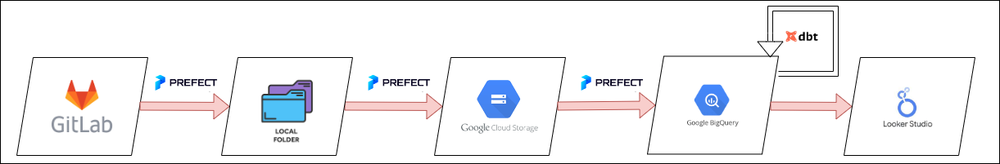
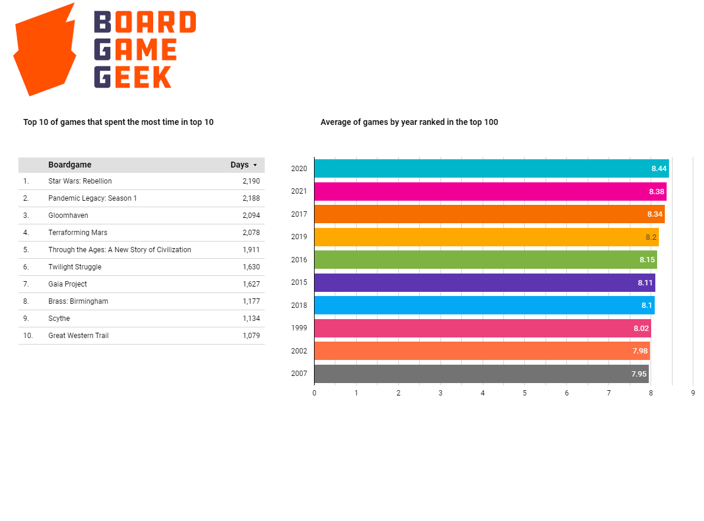

## This project aims to answer two questions related to boardgames rankings on BoardGameGeek:

* Which games spent the most time in the top 10 rankings?
* Which year had the better average for games that reached the top 100?

The analysis is based on the daily rankings of board games collected from the BoardGameGeek website and stored in CSV files on the GitLab repository.
[GitLab Repo](https://gitlab.com/recommend.games/bgg-ranking-historicals/)

The data used in the project are the daily rankings from 2017 until 2022.

## Architecture of the project

## Technology stack
- [Terraform](https://www.terraform.io/)
- [Prefect](https://www.prefect.io/)
- [BigQuery](https://cloud.google.com/bigquery)
- [DBT](https://www.getdbt.com/)
- [Looker Studio](https://lookerstudio.google.com/navigation/reporting)

## Dashboard Preview

## Data Collection

To be able to access the data you need to create an account on https://gitlab.com/ and create a private token.

## The data as the following schema

* **Id**: unique identifier for each boardgame
* **Name**: the name of the boardgame
* **Year**: the year the game was published 
* **Rank**: the rank of the boardgame on the specific day
* **Bayes average**: the bayes average the rank
* **Users rated**: how many user rated the game
* **URL**: URL for the game in the website

## To reproduce the project, follow these steps:

1. Clone this repository to your local machine.
2. Install the required Python libraries listed in requirements.txt.
3. Deploy the GCP infrastructure using Terraform
4. Run prefect locally `prefect orion start` and create blocks (GCS and Big Query) on the Prefect UI
5. Deploy the flows and run them:
      - `ETL_web_to_gcs_data.py` downloads the files as parquet to local folder and then pushes data to Cloud Storage
      - `ETL_gcs_to_bq.py` import raw data into BigQuery tables
4. Run the models on [DBT Cloud](https://cloud.getdbt.com/login)
4. Upon successful completion of infrastructure provisioning and data preparation the dashboard is accessible by this [link](https://lookerstudio.google.com/reporting/1583e2f3-dfd8-43f7-9bab-7a9950e55b96):
    - https://lookerstudio.google.com/reporting/1583e2f3-dfd8-43f7-9bab-7a9950e55b96
    
